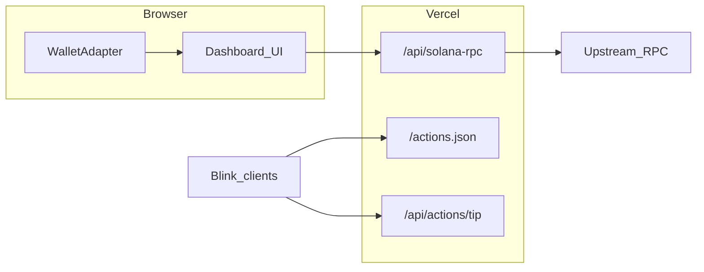

# Solpeek

**Site:** [`https://solpeek.vercel.app`](https://solpeek.vercel.app) — try the [live demo](https://solpeek.vercel.app/dashboard?address=7xKXtg2CW87d97TXJSDpbD5jBkheTqA83TZRuJosgAsU), paste any address, or connect Phantom / Solflare on **Mainnet** or **Devnet**.

**JSON-RPC `403` in the browser:** set **`SOLANA_RPC_URL`** (Helius / QuickNode mainnet HTTPS) on Vercel so **`/api/solana-rpc`** can relay from the server; then redeploy.

If the domain ever shows an old CRA shell (“Solpeek Stream”), open Vercel → **solpeek** → set the latest **Next** build as Production and review **Deployment Protection** for production.

Inspired in part by Solana Foundation [RFP themes](https://solana.com/developers/defi/rfp/free-ideas)—keeping the build small and runnable on Vercel without an indexer.

## Architecture

Mainnet reads go to **`/api/solana-rpc`** (same origin), which forwards to **`SOLANA_RPC_URL`** on the server so keys stay off the client and public-RPC **403** from browsers is avoided. Devnet still uses the public devnet cluster URL. Wallet Adapter uses `@solana/web3.js` (`ConnectionProvider`). There is **no indexer** yet: pagination is capped (default 100 signatures) and parsed transactions load in small batches.

