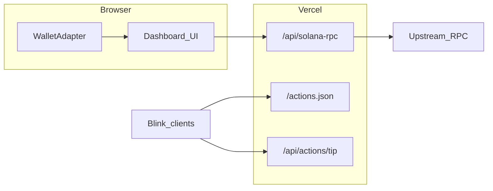

# Solpeek

**Site:** [`https://solpeek-tan.vercel.app`](https://solpeek-tan.vercel.app) — try the [live demo](https://solpeek-tan.vercel.app/dashboard?address=7xKXtg2CW87d97TXJSDpbD5jBkheTqA83TZRuJosgAsU), paste any address, or connect Phantom / Solflare on **Mainnet** or **Devnet**.

**About `solpeek.vercel.app`:** that hostname currently serves an **older Create React App** (“Solpeek Stream”), not this Next repo. Aliasing or `domains add --force` from the **`solpeek`** project returns **403** because the short name is **already bound elsewhere** on Vercel (outside this team’s alias list). To use it again: in the dashboard, open the **team or account that owns that deployment**, remove **`solpeek.vercel.app`** from that project’s **Domains**, then attach it under **solpeek** (Next) or run `vercel domains add solpeek.vercel.app --force` from the linked repo.

**JSON-RPC `403` in the browser:** set **`SOLANA_RPC_URL`** (Helius / QuickNode mainnet HTTPS) on Vercel so **`/api/solana-rpc`** can relay from the server; then redeploy.

Set **`NEXT_PUBLIC_APP_URL`** to your real public origin (for Actions metadata), e.g. **`https://solpeek-tan.vercel.app`**, unless you reclaim **`https://solpeek.vercel.app`** as above.

If Production still looks wrong after that, open Vercel → **solpeek** → confirm the latest **Next** deployment is promoted to Production and check **Deployment Protection**.

Inspired in part by Solana Foundation [RFP themes](https://solana.com/developers/defi/rfp/free-ideas)—keeping the build small and runnable on Vercel without an indexer.

[](LICENSE)

## Architecture

Mainnet reads go to **`/api/solana-rpc`** (same origin), which forwards to **`SOLANA_RPC_URL`** on the server so keys stay off the client and public-RPC **403** from browsers is avoided. Devnet still uses the public devnet cluster URL. Wallet Adapter uses `@solana/web3.js` (`ConnectionProvider`). There is **no indexer** yet: pagination is capped (default 100 signatures) and parsed transactions load in small batches.



## Features

| Area | What it demonstrates |
|------|-----------------------|
| **Instant demo** | Home → “Try live demo” loads a busy mainnet signer with **no wallet connect** |
| **Explorer mode** | `/dashboard?address=<pubkey>` read-only for any wallet or program-owned account |
| **Dashboard** | Paginated signatures, parsed tx stats, heuristic “behavior hints” from program IDs |
| **Mainnet RPC proxy** | Browser → `/api/solana-rpc` → `SOLANA_RPC_URL` (avoids public-RPC **403**) |
| **Cluster toggle** | `mainnet-beta` vs `devnet`, persisted locally |
| **Optional mint lookup** | `getParsedTokenAccountsByOwner` for a pasted mint pubkey |
| **Solana Actions** | `GET/POST OPTIONS` `/api/actions/tip` (+ root [`/actions.json`](./src/app/actions.json/route.ts) for Blink discovery) |

“Heuristic” labels (`swap-like`, etc.) infer intent from observed program IDs (e.g. Jupiter v6, SPL Token)—they are **not** audited classifications.

## Local development

Requirements: Node 20+ recommended.

```bash
cp .env.example .env.local
npm install
npm run dev
```

Open [http://localhost:3000](http://localhost:3000).

## Environment variables

| Variable | Scope | Purpose |
|----------|--------|---------|
| `SOLANA_RPC_URL` | Server | **Mainnet** upstream for `/api/solana-rpc` (Helius / QuickNode HTTPS). Strongly recommended in production. |
| `NEXT_PUBLIC_SOLANA_RPC_URL` | Public | Optional: forces **direct** browser → RPC (skips proxy; URL visible in DevTools). |
| `NEXT_PUBLIC_APP_URL` | Public | Fallback origin for Action metadata when deployed behind proxies (`https://your-app.vercel.app`). |
| `TIP_RECIPIENT` | Server | Solana pubkey (base58) that receives SOL from the Blink tip Action. Omit to show a disabled state in `GET`. |

Copy from [`.env.example`](.env.example).

## Deploy on Vercel

1. Import this repo in [Vercel](https://vercel.com/).
2. Set **Production** variables: **`SOLANA_RPC_URL`** = your Helius / QuickNode mainnet HTTPS URL (required so mainnet demos work—public RPC blocks many browsers). Also set `NEXT_PUBLIC_APP_URL`. Optional: `TIP_RECIPIENT`.
3. Redeploy. Framework preset: Next.js.

## Blink / Actions testing

- Discovery file: `{YOUR_ORIGIN}/actions.json`
- Action endpoint: `{YOUR_ORIGIN}/api/actions/tip`
- When `TIP_RECIPIENT` is unset, wallets still render metadata with a disabled state describing missing configuration.

Official reference: [Actions and blinks — Solana](https://solana.com/developers/guides/advanced/actions).

## Security & disclaimer

Insight cards use **only public chain data**. The tip Action asks you to sign a **`SystemProgram.transfer`** you authorize in your wallet. Review every transaction preview and never expose private keys.

This project is demo software; Solana Labs / Foundation are unrelated.

## Scripts

```bash
npm run dev       # Turbopack dev server
npm run build     # Production build + typecheck
npm run lint      # ESLint
```
