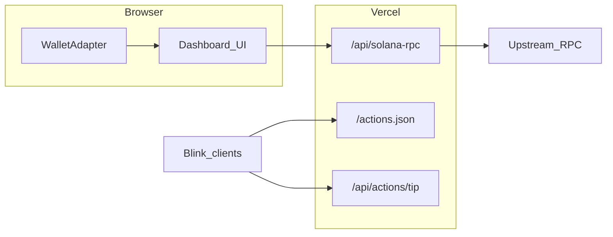

# Solpeek

**Site:** [`https://solpeek-live.vercel.app`](https://solpeek-live.vercel.app) — try the [live demo](https://solpeek-live.vercel.app/dashboard?address=7xKXtg2CW87d97TXJSDpbD5jBkheTqA83TZRuJosgAsU), paste any address, or connect Phantom / Solflare on **Mainnet** or **Devnet**.

Production is wired to the Vercel project **`solpeek-live`** (Next.js on this repo). After `git clone`, run `vercel link` and pick that project if you deploy from the CLI.

**JSON-RPC `403` in the browser:** set **`SOLANA_RPC_URL`** (Helius / QuickNode mainnet HTTPS) on Vercel so **`/api/solana-rpc`** can relay from the server; then redeploy.

On Vercel → **solpeek-live** → **Environment Variables**, set **`NEXT_PUBLIC_APP_URL`** to **`https://solpeek-live.vercel.app`** (Actions metadata), **`SOLANA_RPC_URL`**, and any optional vars (then **Redeploy**).

If Production looks gated or stale, open **solpeek-live** → **Deployments** → confirm the latest build is promoted and review **Deployment Protection**.

Inspired in part by Solana Foundation [RFP themes](https://solana.com/developers/defi/rfp/free-ideas)—keeping the build small and runnable on Vercel without an indexer.

[](LICENSE)

## Why this exists (business angle—not “yet another RPC passthrough”)

**Scrapers** mirror blobs of chain state; **explorers** optimize for infinite transaction scroll. Neither produces a crisp *artifact* you can attach to underwriting, OTC, custody escalation, or product UX. Solpeek is deliberately a **bounded program-footprint synopsis**: dominant programs touched, heuristic lane tags (DEX-like, SPL, voting, memo, NFT metadata footprints), success vs failure in sample—exported as **deterministic deep links** (`/dashboard?address=…`) your ops stack can cite.

### Incorporation story (illustrative: exchange-grade desks)

Venues with Solana payouts, listings, staking, custody, or institutional onboarding need repeatability: *what did we know at decision time about this pubkey?* This repo slots into that narrative as MIT-licensed scaffolding you host—**same-origin RPC proxy** for secret hygiene + **readable rollup code** auditors can inspect. It is **not** a sanctioned-party database, KYC engine, or full-history indexer; it complements those systems with a lightweight, human-legible prelude you can bolt policy onto.

Teams evaluating integration (Gemini-caliber desks, OTC primes, treasury SaaS, regulated custodians) get a differentiated hook: ship **articulable evidence** derived from bounded public-RPC reads faster than commissioning bespoke chain scrapers—with an honest scope box (recent window cap, heuristic labels—not court-grade attribution).

### Still useful solo

Traders/devs inherit the same surface for quick counterpart skims—just without SSO and policy layers bolted on.

## Architecture

Mainnet reads go to **`/api/solana-rpc`** (same origin), which forwards to **`SOLANA_RPC_URL`** on the server so keys stay off the client and public-RPC **403** from browsers is avoided. Devnet still uses the public devnet cluster URL. Wallet Adapter uses `@solana/web3.js` (`ConnectionProvider`). There is **no indexer**: the UI caps history (default **48** newest signatures) and loads parsed `getTransaction` calls as **parallel single-RPC requests** (not JSON-RPC batch arrays), which stays compatible with free RPC tiers that disallow batching.



## Features

| Area | What it demonstrates |
|------|-----------------------|
| **Instant demo** | Home → “Try live demo” loads a busy mainnet signer with **no wallet connect** |
| **Explorer mode** | `/dashboard?address=<pubkey>` read-only for any wallet or program-owned account |
| **Dashboard** | Bounded-window program rollup + heuristic “behavior hints” (explorer-style tx lists deliberately out of scope for speed) |
| **Mainnet RPC proxy** | Browser → `/api/solana-rpc` → `SOLANA_RPC_URL` (avoids public-RPC **403**) |
| **Cluster toggle** | `mainnet-beta` vs `devnet`, persisted locally |
| **Optional mint lookup** | `getParsedTokenAccountsByOwner` for a pasted mint pubkey |
| **Solana Actions** | `GET/POST OPTIONS` `/api/actions/tip` (+ root [`/actions.json`](./src/app/actions.json/route.ts) for Blink discovery) |

“Heuristic” labels (`swap-like`, etc.) infer intent from observed program IDs (e.g. Jupiter v6, SPL Token)—they are **not** audited classifications.

## Local development

Requirements: Node 20+ recommended.

```bash
cp .env.example .env.local
npm install
npm run dev
```

Open [http://localhost:3000](http://localhost:3000).

## Environment variables

| Variable | Scope | Purpose |
|----------|--------|---------|
| `SOLANA_RPC_URL` | Server | **Mainnet** upstream for `/api/solana-rpc` (Helius / QuickNode HTTPS). Strongly recommended in production. |
| `NEXT_PUBLIC_SOLANA_RPC_URL` | Public | Optional: forces **direct** browser → RPC (skips proxy; URL visible in DevTools). |
| `NEXT_PUBLIC_APP_URL` | Public | Fallback origin for Action metadata when deployed behind proxies (`https://your-app.vercel.app`). |
| `TIP_RECIPIENT` | Server | Solana pubkey (base58) that receives SOL from the Blink tip Action. Omit to show a disabled state in `GET`. |

Copy from [`.env.example`](.env.example).

## Deploy on Vercel

1. Link **Git**: connect repository [**adeetya-u/solana-wallet-story**](https://github.com/adeetya-u/solana-wallet-story), **Production branch** `main`, **Root Directory** `.` (repo root). Use—or create—a project named **`solpeek-live`** if you want the same hostname convention.
2. Set **Production** variables: **`SOLANA_RPC_URL`** = your Helius / QuickNode mainnet HTTPS URL (required so mainnet demos work—public RPC blocks many browsers). Also set **`NEXT_PUBLIC_APP_URL=https://solpeek-live.vercel.app`** (or your deployed origin). Optional: **`TIP_RECIPIENT`**.
3. Redeploy. Framework preset: Next.js (`vercel.json` already pins install/build).

## Blink / Actions testing

- Discovery file: `{YOUR_ORIGIN}/actions.json`
- Action endpoint: `{YOUR_ORIGIN}/api/actions/tip`
- When `TIP_RECIPIENT` is unset, wallets still render metadata with a disabled state describing missing configuration.

Official reference: [Actions and blinks — Solana](https://solana.com/developers/guides/advanced/actions).

## Security & disclaimer

Insight cards use **only public chain data**. The tip Action asks you to sign a **`SystemProgram.transfer`** you authorize in your wallet. Review every transaction preview and never expose private keys.

This project is demo software; Solana Labs / Foundation are unrelated.

## Scripts

```bash
npm run dev       # Turbopack dev server
npm run build     # Production build + typecheck
npm run lint      # ESLint
```
